```{r, include = FALSE}
knitr::opts_chunk$set(
  collapse = TRUE,
  comment = "#>"
)
```

Welcome to the numerical example of the Ensembles package. This vignette will walk you through each of the steps and features of the numerical function, allowing you to beat the best score in a Kaggle contest by 699 college students. The student results were the Spring term project for 49 teams with 699 entries. This solution using the Ensembles package will beat their best solution by more than 90%, and only require one line of code. The student results will be our baseline against which we will compare our results.

### Background on the Boston housing data set

The Boston Housing data set is a collection of data about 505 houses in the Boston, Massachusetts area. The data is taken from the 1970 United States census, and has been studied by numerous researchers and used in many competitions. The original research was published in 1978.

Let's start by taking a quick look at the first ten rows of the Boston Housing data set:

```{r head of the Boston Housing data set}
library(MASS)
head(MASS::Boston, n = 10)
```

The data contains 14 columns. All of the columns are numerical. We will be modeling the 'medv' column. This column measures the median value of the home.

The only thing you have to do is make sure the data does not contain any missing values, and that the values are numbers. We'll deal with the common case where the values are not numbers in a different vignette.

```{r check for any missing values}
sum(is.na(MASS::Boston))
```

Great! There are no missing values. Now let's look at the type of data we have in the data set to see if they are all numbers:

```{r check the type of data in the Boston housing data set}
str(MASS::Boston)
```

Excellent! All of the values are numbers, so we're ready to go. We begin by attaching the Ensembles package.

```{r setup install the Ensembles package}
library(Ensembles)
```

### Minimal example of numerical analysis

Now we'll do our one line of code to have the Ensembles package complete the analysis. We'll only use the first three functions (where is the data, what is the column number and how many times do we want to resample the data, as well as setting up the amounts for train, test and validation. We will set all the other values so they are not used this time. We will look at them in the next example)

Let's look at what 'data', 'colnum', and 'numresamples' do.

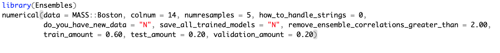{width="752"}

The 'data' can either be a a data set from an R package, or a link to a csv file. The csv file can be on your system, or online. In this example we are using MASS::Boston as our data.

'colnum' is the column number. In this case we are looking at column 14, the median value of the house. This is the same as the column number by the college students, and virtually everyone else who works on the Boston housing data set.

'numresamples' is the first of several features to make the results reproducible. The numerical function will randomly resample the data the number of times you chose. For now we have selected 5, but you may pick any value you wish. As you will see, a higher the number of resamples will make the results more reproducible.

For now we will skip these four features and come back to those in a little bit: 'how_to_handle_strings', 'do_you_have_new_data', 'save_all_trained_models', and 'remove_ensemble_correlations_greater_than'. In our example here, they are all set to values where they will not run.

### Setting up train, test and validation amounts.

Set the train, test and validation to values you wish to use. A very good set of values is:

train: 0.60

test: 0.20

validation: 0.20

We have used these values in this example.

### Once it starts, what does this function do?

1.  It sets up the number of resamples you chose. That number is 5 in this example.
2.  It randomly separates the data (Boston housing) into train, test and validation sets.
3.  It builds models on 23 solution methods (full list below). The models are in alphabetical order, to make it easier to find and use. The function will fit the model on the training data, then make predictions on both the test and validation data. It will measure the root mean squared error for each model. It will save each result, so that a mean result may be determined and reported back to the user.

### Automatically building 23 individual models. These are a combination of R and Python, regular learning and deep learning models.

1.  Bagged Random Forest
2.  Bagging
3.  Bayes Generalized Linear Models
4.  Bayes Regularization for feed forward neural networks
5.  Boosted Random Forest
6.  Cubist
7.  Elastic Net
8.  GAM (Generalized Additive Models) with Smoothing Splines
9.  Gradient Boosted
10. K-Nearest Neighbors
11. Lasso Net
12. Linear
13. LQS
14. Neuralnet
15. Partial Least Squares
16. Principal Components Analysis
17. Random Forest
18. Ridge Net
19. Robust Regression
20. Rpart (also known as cart)
21. Support Vector Machines
22. Trees
23. XGBoost

### Automatically building the indexed ensembles from the holdout (testing and validation) predictions

Next the function is going to build an ensemble of the predictions of the *holdout data* from the models. The ensemble is indexed so that the y values in the ensemble exactly match the corresponding row in the data. A picture makes this much easier to understand.

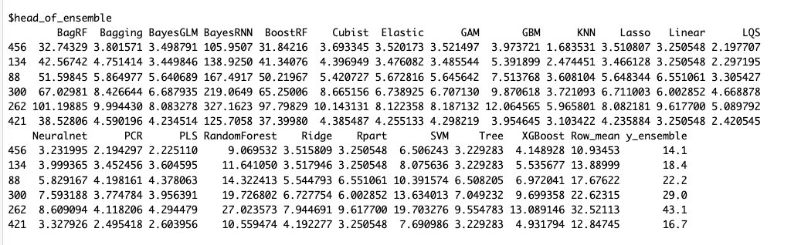{width="800"}

### Automatically indexing the ensemble, even when the rows are repeatedly randomized

The final value, y_ensemble, exactly matches the corresponding value in the original data. In this case that is the Boston Housing data set. Let us test that claim. The row name is the far left number, the medv value is y_ensemble. Here is the test:

```{r testing if the y_ensemble values match the corresponding values in Boston Housing}
MASS::Boston[c(456,134,88,300,262,421), 14]
```

The result is a perfect match for all values: 14.1 18.4 22.2 29.0 43.1 16.7.

### Automatically weighting the ensemble

Each column (such as XGBoost) is weighted by the reciprocal of the RMSE value. Thus more accurate models get higher weights, and less accurate models get lower weights. For example, 1/2 is much larger than 1/10. This is the principle that applies to weighting the ensembles.

### Automatically splitting the ensemble into train, test and validation sets.

The function will automatically split the ensemble into train, test and validation amounts, based on the initial values set by the user. In our example those values are 60% train, 20% test and 20% validation. Thus the function will automatically create:

ensemble_train

ensemble_test

ensemble_validation

### Automatically building ensemble models

From here it is very easy to build models using the ensemble data set. It is done exactly the same way as individual data sets. Fit the model on the ensemble training set, and then make predictions on the ensemble test and validation sets, and measure root mean squared error. For example, here is how the cubist model is used to fit the ensemble data:

Cubist::cubist(x = ensemble_train[,1:ncol(ensemble_train)-1], y = ensemble_train\$y_ensemble)

### Automatically measuring root mean squared error (RMSE) on the ensemble holdout data

This is exactly the same as with the individual models. The function measures the root mean squared error on the ensemble holdout data, testing and validation. It saves each one of those values.

### Automatically loop back to the beginning, randomize the rows again, repeat as many times as the user chose (in our example that is 5 times).

### Automatically report summary results, tables, graphs, and charts to the user

The numerical function automatically reports all of these results to the user:

Automatic results reported in the Console:

1.  Data dictionary of the original data: 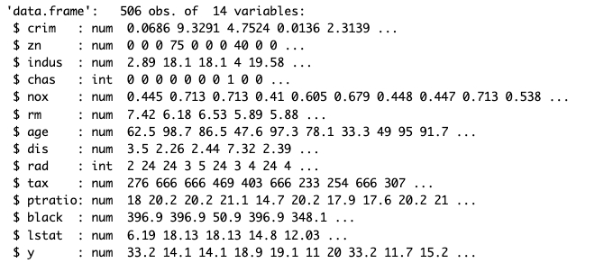{width="750"}
2.  Correlation table of the original data (in this case Boston Housing): 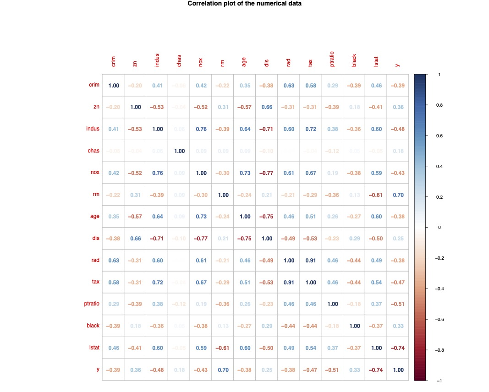{width="750"}
3.  Data summary (minimum values, means, etc.) of the original data: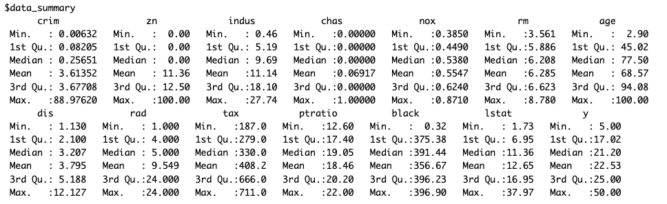{width="750"}
4.  Head of the weighted and indexed ensemble: {width="750"}
5.  Correlation table of the ensemble. Note that we are using very strongly correlated predictors in this example. That will be addressed in the next example: 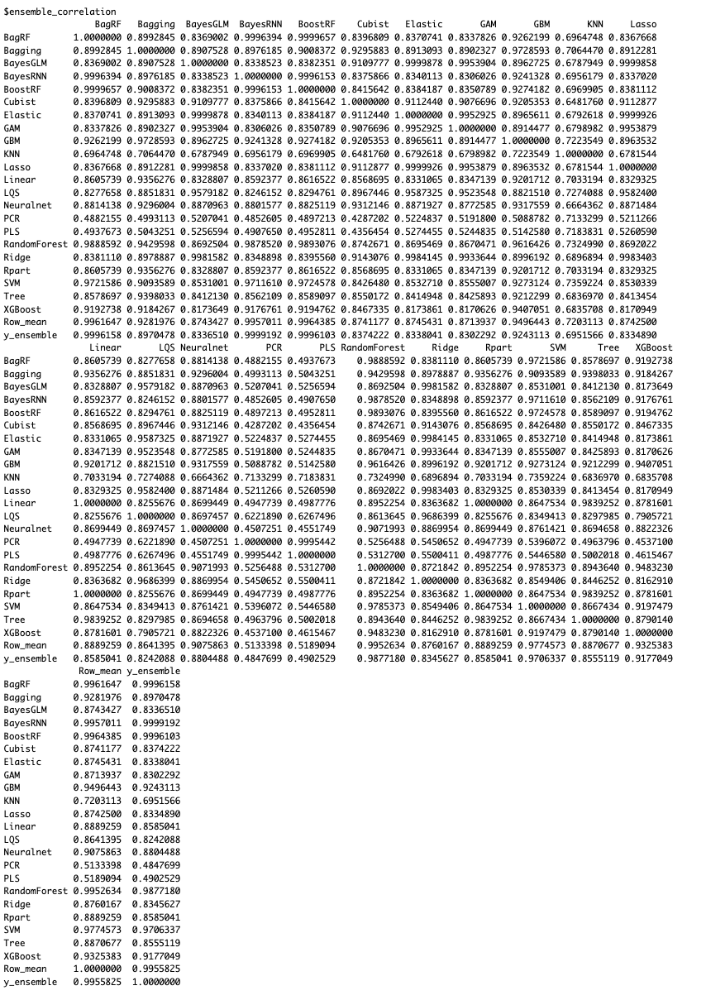{width="750"}

Automatic results reported in Plots:

1.  Pairwise scatter plots and histograms of the numerical data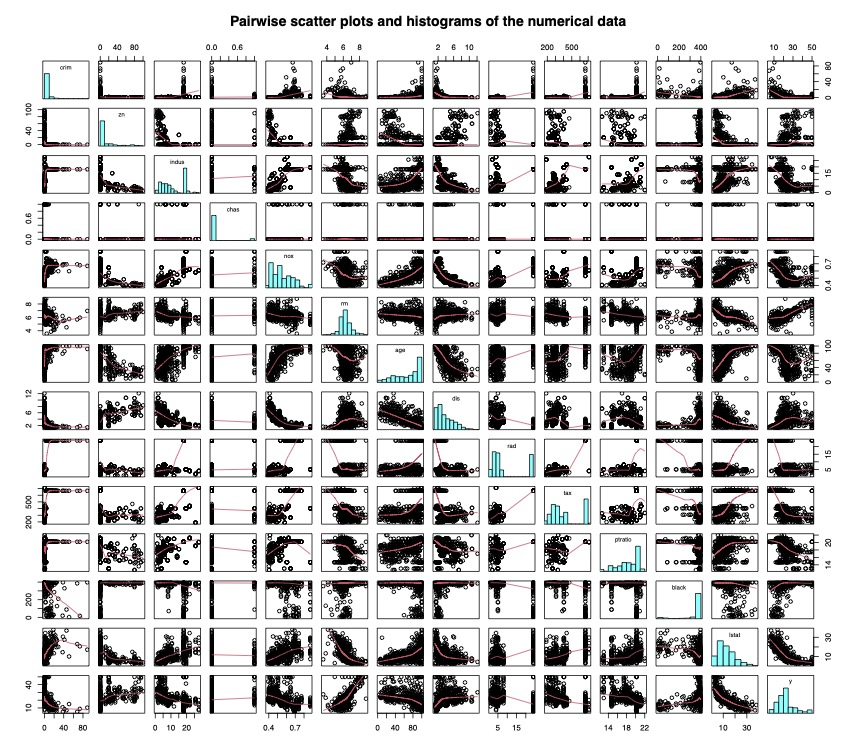{width="750"}

2.  Correlation plot as numbers in color. {width="750"}

3.  Correlation plot as circles in color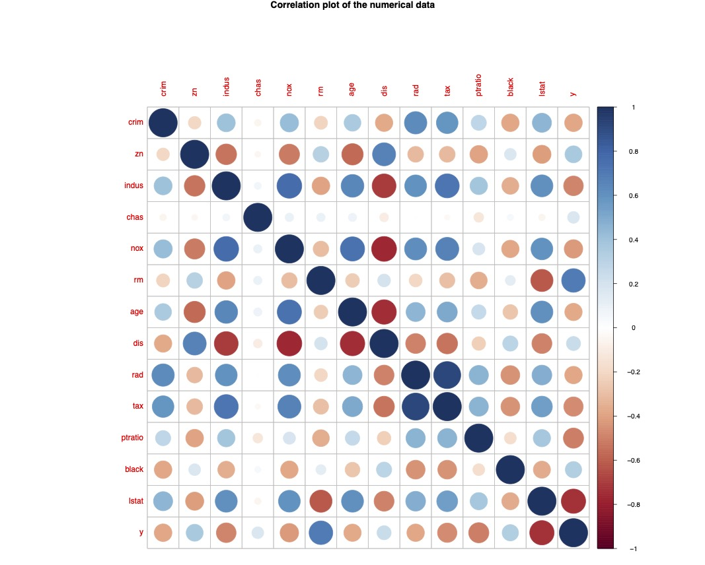{width="750"}

4.  Best model: Results of Predicted vs Actual, Residuals vs Actual, Histogram of Residuals, all in one image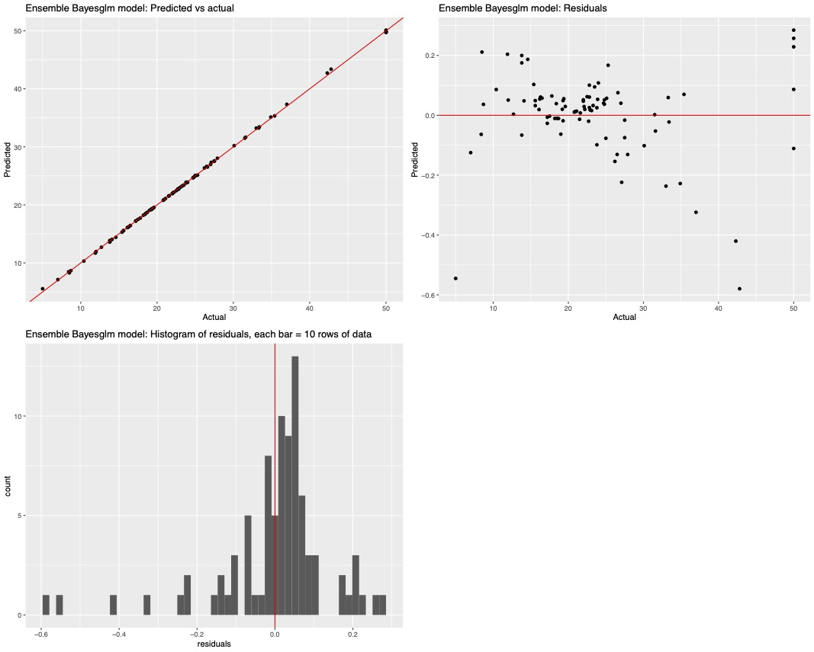{width="750"}

5.  Best model: Actual vs predicted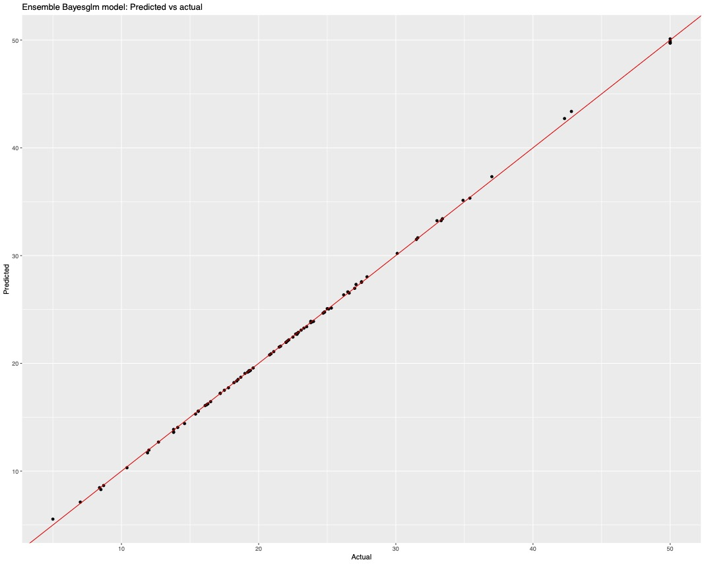{width="750"}

6.  Best model: Actual vs residuals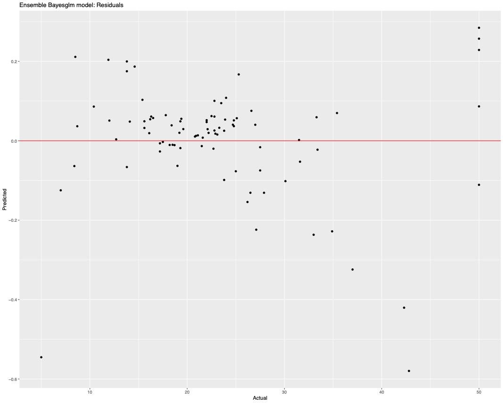{width="750"}

7.  Best model: Histogram of residuals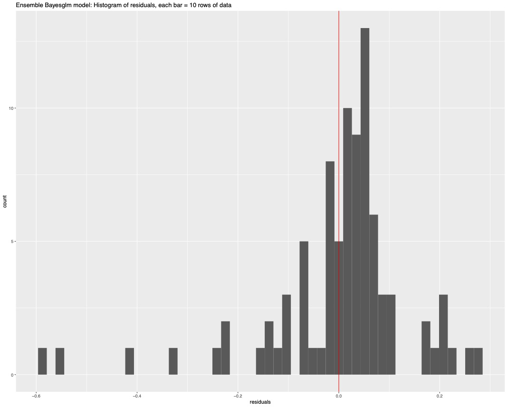{width="750"}

8.  40 models, accuracy for each model, and each sample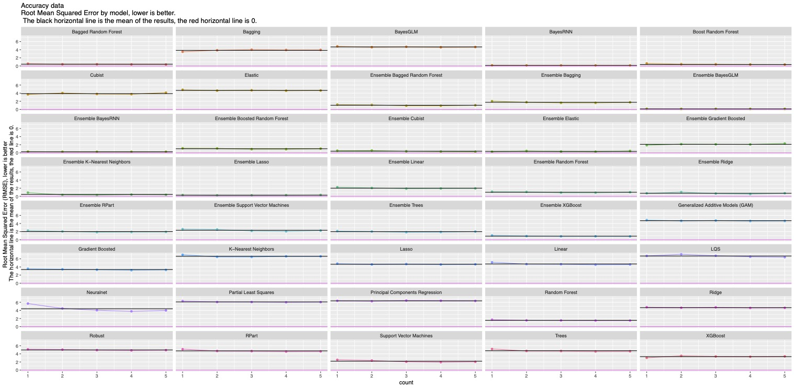{width="750"}

9.  40 models, accuracy for each model, also shows train, test and validation results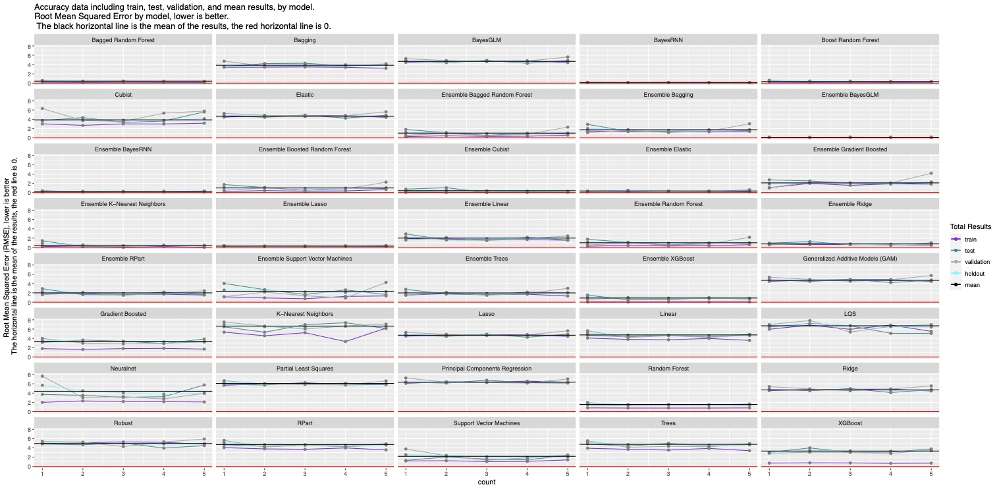{width="750"}

10. Histogram of each numeric column.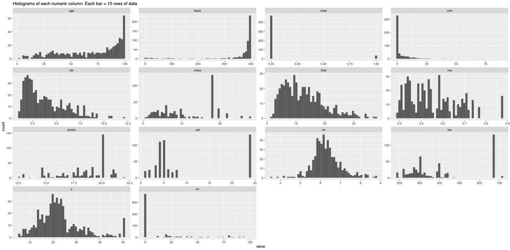{width="750"}

11. Boxplot of each numeric column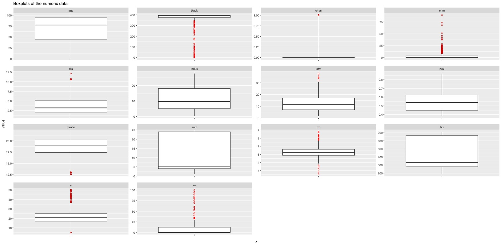{width="750"}

12. Summary report, sorted by root mean squared error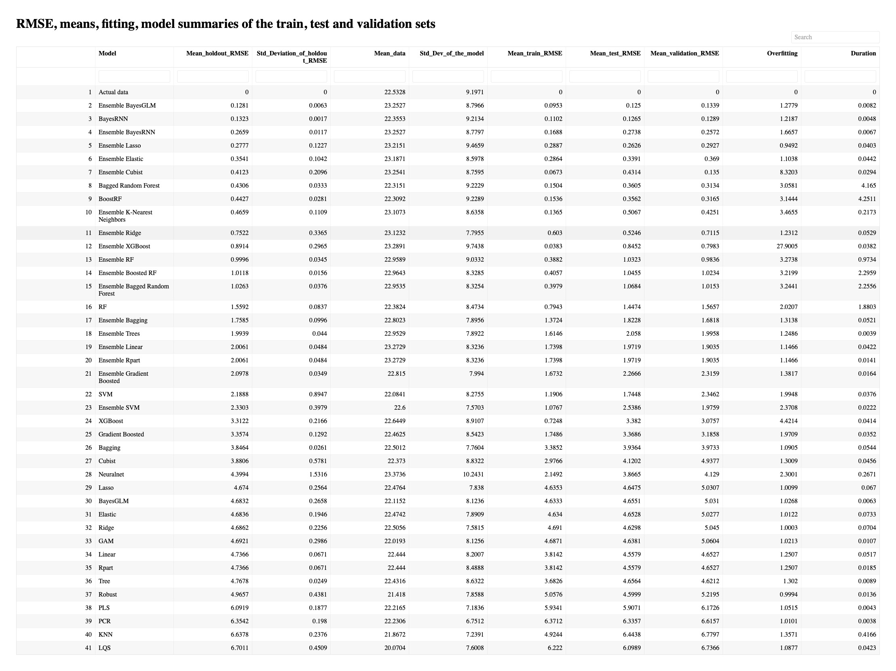{width="750"}

### Did the automated results using the Ensembles package beat the best results by the college students in their 699 Kaggle submissions? Let's test that out:

The college student scores are here: <https://www.kaggle.com/competitions/uou-g03784-2022-spring/leaderboard>

The lowest root mean squared error for the college students (out of 699 entries) is 2.41243.

The lowest score for the fully automated solution using the Ensembles package is 0.1281. This means the automated solution using the Ensembles package is a 94.69% decrease. According to the website <https://www.calculatorsoup.com/calculators/algebra/percent-change-calculator.php>\
\
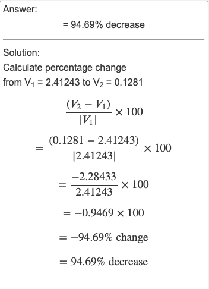

### Part 2: The Advanced Features in the Numerical Function
